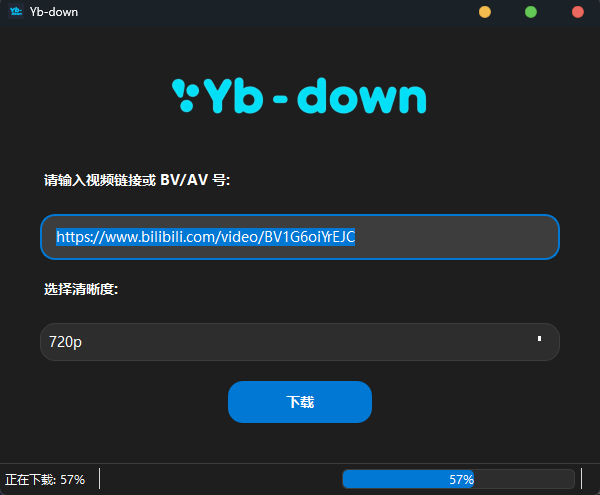

# 📥 Yb-down 视频下载工具

Yb-down——一个快捷的 <strong>YouTube/哔哩哔哩</strong> 下载器
>此程序支持linux、windows10+ 等系统，切换分支，查看其他系统的版本

<div align="center">
  
</div>

<div align="center">
  <span style="display:inline-block;">
    
  </span>
  <span style="display:inline-block;">
    
  </span>
  <span style="display:inline-block;">
    
  </span>
  <span style="display:inline-block;">
    
  </span>
  <span style="display:inline-block;">
    
  </span>
</div>

## 📝 简介

Yb-down 是一个基于 Python 开发的视频下载工具，支持从 YouTube 和哔哩哔哩(B站)下载视频。它提供了一个简洁美观的图形界面，支持多种清晰度选择，并能够显示实时下载进度。

<div align="center">
  
</div>

<center>⬆️演示图片</center>

## ⭐ 功能特点

- 支持 YouTube 和 B站视频下载
- 支持多种视频清晰度选择
- 支持音频提取（可选择音质）
- 智能代理模式（YouTube自动使用代理，B站直连）
- 实时下载进度显示
- 支持 BV号/AV号 直接输入

## 🛠️ 安装要求（Linux）

- Python 3.9 及以上（推荐 3.10）
- FFmpeg（可用系统包或单文件版，建议放在程序根目录）
- yt-dlp（可用 pip 安装或单文件版，建议放在程序根目录）
- 依赖包：
  - PySide6
  - PyYAML

### 安装依赖

```bash
sudo apt update
sudo apt install python3 python3-pip ffmpeg
pip install PySide6 PyYAML yt-dlp
```

如需使用单文件版 ffmpeg/yt-dlp，请将其放在程序根目录。

### 运行程序

```bash
python3 main.pyw
```

### 打包为可执行文件（可选）

```bash
pip install pyinstaller
pyinstaller --onefile --name "yb-down" --icon "src/logo.png" --add-data "src/logo.png:src" --add-data "settings.yaml:." --add-data "ffmpeg:." --add-data "yt-dlp:." main.pyw
```

打包后可直接运行 `dist/yb-down`。

### 安装 deb 包（可选）

1. 按照 [打包说明](#) 构建 deb 包。
2. 安装依赖库（如 Qt 相关库）：
   ```bash
   sudo apt install libxcb-cursor0 libxcb-xinerama0 libxcb-icccm4 libxcb-image0 libxcb-keysyms1 libxcb-render-util0 libxkbcommon-x11-0 libxcb-xfixes0
   ```
3. 安装 deb 包：
   ```bash
   sudo apt install ./yb-down_xxx.deb
   ```

## ⚙️ 配置说明

- 配置文件为 `settings.yaml`，可自定义存储位置、代理、清晰度等参数。
- 图标和资源文件请使用 `.png` 或 `.svg` 格式，避免使用 `.ico`。

## 🐧 Linux 适配说明

- 路径分隔符已适配 Linux。
- 图标和资源路径通过 `resource_path` 自动适配打包环境。
- `.desktop` 文件已集成，安装 deb 包后自动出现在 GNOME/KDE 等桌面菜单中。
- 若需桌面快捷方式，请手动从 `/usr/share/applications/yb-down.desktop` 复制到桌面，并赋予执行权限。

---

如有问题欢迎提
