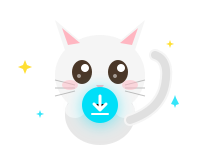
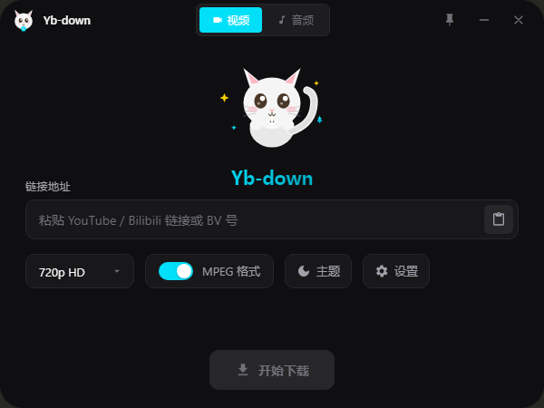

# 📥 Yb-down 视频下载工具

Yb-down——一个快捷的 <strong>YouTube/哔哩哔哩</strong> 下载器

> 此程序支持 Windows 10+ 系统  
> 基于 Electron 构建的全新版本，采用现代化 UI 设计

<div align="center">
  
</div>

<div align="center">
  <span style="display:inline-block;">
    
  </span>
  <span style="display:inline-block;">
    
  </span>
  <span style="display:inline-block;">
    
  </span>
  <span style="display:inline-block;">
    
  </span>
  <span style="display:inline-block;">
    
  </span>
</div>

---

## 🎨 全新界面

<div align="center">
  
</div>

<center>⬆️ 全新 Electron 版本界面</center>

### 设计特点
- 🌈 **8 种主题色 + 自定义颜色**
- 🌙 **深色/浅色模式切换**
- 😺 **可爱猫咪角色封面**
- ✨ **圆角无边框窗口**
- 🎭 **现代化扁平设计**

---

## 📝 简介

Yb-down 是一个基于 Electron 开发的视频下载工具，支持从 YouTube 和哔哩哔哩(B站)下载视频。全新版本采用现代化 UI 设计，支持主题色自定义、深色模式、独立设置窗口等功能。

---

## ⭐ 功能特点

### 下载功能
- ✅ 支持 YouTube 和 B站视频下载
- ✅ 支持多种视频清晰度选择 (360p/480p/720p/1080p(哔哩哔哩1080p需要cookie,暂时不支持))
- ✅ 支持仅音频下载（可选择音质）
- ✅ 支持 MPEG 格式转换
- ✅ 实时下载进度显示
- ✅ 支持 BV号/AV号 直接输入

### 界面功能
- 🎨 **8 种预设主题色**：青色、绿色、红色、橙色、紫色、黄色、粉色 + 自定义
- 🌓 **深色/浅色模式**：一键切换，自动保存
- ⚙️ **图形化设置界面**：独立设置窗口，实时生效
- 📁 **下载目录选择**：可视化文件夹选择
- 🔗 **代理设置**：支持 HTTP/SOCKS5 代理

---

## 🛠️ 安装要求

### 系统要求
- Windows 10 或更高版本
- Node.js 18.x 或更高版本

### 依赖项
- FFmpeg（用于视频处理）
- yt-dlp（用于下载视频）

### 安装步骤

1. **克隆仓库**
```bash
git clone https://github.com/yourusername/yb-down.git
cd yb-down
```

2. **安装依赖**
```bash
npm install
```

3. **运行应用**
```bash
npm start
```

---

## ⚙️ 配置说明

设置可通过图形化界面或手动编辑 `settings.yaml` 文件：

```yaml
# 主题颜色
color: "blue"  # blue/green/red/orange/purple/yellow/pink/custom

# 自定义颜色 (当 color 为 custom 时生效)
customColor: "#FF6B9D"

# 深色模式
darkMode: true

# 存储位置
存储位置: "C:/Users/Administrator/Desktop/"

# 代理模式
代理模式: "auto"  # auto/on/off

# 代理地址
代理地址: "http://127.0.0.1:7890"

# 清晰度选项
清晰度选项:
  - "360p"
  - "480p"
  - "720p"
  - "1080p"
  - "仅音频 64k"
  - "仅音频 128k"

# 默认清晰度
默认清晰度: "360p"
```

---

## 🔧 使用说明

1. **启动程序**
   - 双击运行或执行 `npm start`

2. **粘贴链接**
   - 在输入框中粘贴 YouTube 或 B站视频链接
   - 支持 BV/AV 号直接输入

3. **选择选项**
   - 选择所需的清晰度/音质
   - 可选择是否转换为 MPEG 格式

4. **开始下载**
   - 点击下载按钮开始下载
   - 实时查看下载进度

5. **自定义设置**
   - 点击"设置"按钮打开设置窗口
   - 修改主题色、下载目录、代理等选项

---

## 🎨 主题系统

### 预设主题色

| 主题 | 颜色值 | 预览 |
|:----:|:------:|:----:|
| 青色 | #02DFF8 | 🔵 |
| 绿色 | #22C55E | 🟢 |
| 红色 | #EF4444 | 🔴 |
| 橙色 | #F97316 | 🟠 |
| 紫色 | #A855F7 | 🟣 |
| 黄色 | #EAB308 | 🟡 |
| 粉色 | #EC4899 | 💗 |
| 自定义 | 任意 HEX | 🎨 |

### 切换主题
1. 点击主界面的"主题"按钮切换深色/浅色模式
2. 在设置窗口中选择喜欢的主题颜色
3. 设置自动保存，下次启动时生效

---

## 🔗 支持的链接格式

### YouTube
- 标准链接：`https://www.youtube.com/watch?v=xxxx`
- 短链接：`https://youtu.be/xxxx`

### Bilibili
- 视频页面：`https://www.bilibili.com/video/xxxxx`
- BV号：`BVxxxxx`
- AV号：`AVxxxxx`

---

## 📦 打包说明

使用 electron-packager 打包为可执行文件：

```bash
npm run package
```

或手动打包：

```bash
npx electron-packager . Yb-down --platform=win32 --arch=x64 --out=dist --icon=src/ico.ico
```

---

## 🖥️ 开发技术栈

- **框架**: Electron 28.x
- **前端**: HTML5 + CSS3 + Vanilla JavaScript
- **配置**: YAML (js-yaml)
- **样式**: CSS Variables + Flexbox
- **图标**: SVG

---

## 📁 项目结构

```
yb-down/
├── index.html          # 主窗口界面
├── settings.html       # 设置窗口界面
├── main.js             # 主进程逻辑
├── preload.js          # 预加载脚本
├── renderer.js         # 渲染进程逻辑
├── settings.yaml       # 用户配置文件
├── ui.md               # UI 设计文档
├── RPD.md              # 需求与设计文档
├── package.json        # 项目配置
└── src/
    ├── logo.png        # 应用 Logo
    └── ico.ico         # 窗口图标
```

---

## ⚠️ 注意事项

1. **YouTube 下载需要配置正确的代理**
2. **下载失败时请检查网络连接和代理设置**
3. **部分视频可能因清晰度和版权限制无法下载**
4. **哔哩哔哩 1080p 及以上需要登录 Cookie（暂不支持）**

---

## 📝 更新日志

### v2.0.0 (2026-03-22)
- ✨ 全新 Electron 版本
- 🎨 8 种主题色 + 自定义颜色
- 🌙 深色/浅色模式切换
- ⚙️ 图形化设置界面
- 😺 可爱猫咪角色封面
- ✨ 现代化扁平设计

### v1.0.0 (早期版本)
- 基于 PyQt5 的初始版本
- 基础下载功能
- YAML 配置文件

---

## 📜 许可说明

本项目仅供学习和个人使用，请勿用于商业用途。使用本工具下载视频时，请遵守相关网站的使用条款和版权规定。

---

<div align="center">
  <sub>Built with ❤️ using Electron</sub>
</div>
